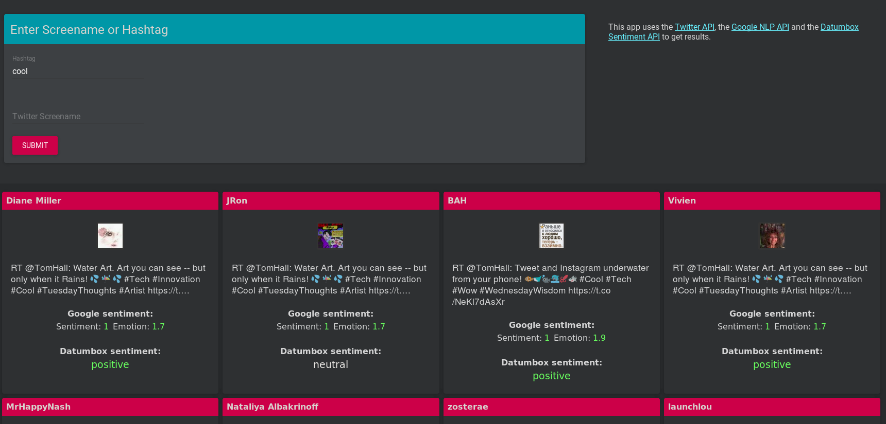
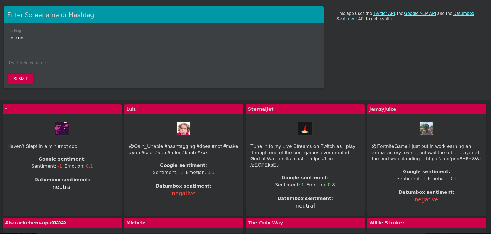
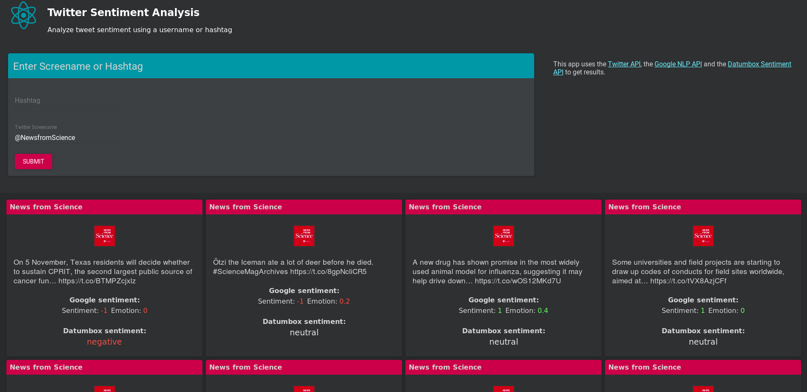

## Twitter Sentiment Analysis

# Built with:

- React
- Node
- DatumBox Sentiment API
- Google Sentiment API

Positive hashtag example:


Negative hashtag example:


Username example:



# Description:

Analyze tweet sentiment using an username or hashtag using two sentiment APIs. I originally created this app a couple years ago but it is tested on:

Node 12.18.2
Npm  6.14.7

The live app is running on Herkoku and can be tried out at: 
https://salty-journey-93853.herokuapp.com/

# Requirements

In order to run this app, you will need to sign up for the following free APIs:

1. The Datumbox Machine Learning API:
 https://www.datumbox.com/machine-learning-api/ 

2. The Google Natural Language Processing API:
   https://cloud.google.com/natural-language/docs/basics

3. The Twitter API https://developer.twitter.com/en/docs


After signing up for the APIs, create a file called 'config.js' in the repository root with the following API credentials:

const config = {
  twitter: {
    consumer_key: '',
    consumer_secret: '',
    access_token: '',
    access_token_secret: ''
  },
  google: {
    "apiKey" : ''
  },
  datumBox: {
    "apiKey" : '',
  },
  port: process.env.PORT || 3000
};

module.exports = config;

To change ports or HOST to a live URL edit the .env file

# Usage


1. Install dependencies and run the app from the root directory: 
```
   cd NodeTwitterSentiment
   npm install
   npm start
```

API requests will be visible via terminal output

2. Go to http://0.0.0.0:3000/ to see the App

TODO:
Average sentiments from both APIs and render on front end
Dockerfile
Get All Tweets
